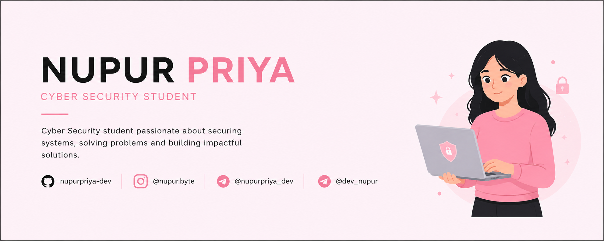

# 🛡️ NUPUR PRIYA

### Cyber Security Student • Developer • Tech Explorer


<div align="center">



</div>
<div align="center">


<br>

[](https://github.com/nupurpriya-dev)
[](https://instagram.com/nupurpriya_dev)
[](https://t.me/nupurpriya_dev)
[](https://t.me/dev_nupur)

</div>

---

## 👩‍💻 About Me

Hey! I'm **Nupur Priya**, a Cyber Security student at **Darbhanga College of Engineering**.

I'm passionate about technology, cybersecurity, programming, Linux environments, web technologies, and automation.

I enjoy exploring how systems work, experimenting with different tools and technologies, and turning what I learn into practical projects.

```
┌──────────────────────────────────────────┐
│              NUPUR PRIYA                  │
├──────────────────────────────────────────┤
│ 🎓 Cyber Security Student                 │
│ 🏫 Darbhanga College of Engineering       │
│ 🛡️ Cyber Security & Ethical Hacking       │
│ 🐧 Linux / Kali Linux / Termux            │
│ 💻 Programming & Development              │
│ 🤖 Telegram Bots & Automation             │
│ 🌐 Web & REST APIs                        │
│ 🗄️ Databases & SQL                        │
└──────────────────────────────────────────┘
```

---

## 🛠️ Tech Stack

### 💻 Programming

<p>
  
</p>

### 🌐 Web & APIs

<p>
  
</p>

`REST APIs` • `Website Designing` • `Web Technologies`

### 🗄️ Databases

<p>
  
</p>

`MongoDB` • `SQL` • `DBMS`

### 🐧 Operating Systems & Environment

<p>
  
</p>

`Linux` • `Kali Linux` • `Windows` • `Termux` • `CLI` • `Terminal`

### 🤖 Development & Automation

`Python Automation` • `Telegram Bots` • `REST APIs` • `CLI Tools`

---

## 🛡️ Cyber Security

My primary area of interest is **Cyber Security**.

I'm currently developing my knowledge around:

- 🔐 Cyber Security Fundamentals
- 🐧 Linux & Kali Linux
- ⌨️ Command Line & Terminal
- 🧰 Cyber Security Tools
- 🌐 Web Security
- 🔌 REST APIs
- 💻 Operating Systems
- 🗄️ SQL & Databases
- 📱 Termux & Mobile Environments
- 🤖 Security Automation

> *"Understand the system. Find the weakness. Build it better."*

---

## 🧠 Knowledge

**Programming**
- Python
- C
- C++
- Java
- JavaScript
- TypeScript

**Development**
- HTML
- REST APIs
- Website Designing
- Telegram Bots

**Cyber Security**
- Kali Linux
- Linux
- Security Tools
- CLI
- Operating Systems

**Database**
- MongoDB
- SQL
- DBMS

**Environment**
- Windows
- Linux
- Termux

**Other**
- UHV

---

## 🚧 Projects

**STATUS: BUILDING...**

This is a brand-new GitHub profile, so there are currently no public repositories.

I'm still learning, experimenting, and working toward building projects that I'm proud to publish.

### 🔮 Coming Soon

| Category                    | Status         |
|------------------------------|----------------|
| 🛡️ Cyber Security Projects  | 🔄 In Progress |
| 🐍 Python Projects           | 🔄 In Progress |
| 🤖 Telegram Bots             | 🔄 In Progress |
| 🌐 Web Projects              | 🔄 In Progress |
| 🔌 API Projects              | 🔄 In Progress |
| 🐧 Linux / CLI Tools         | 🔄 In Progress |
| 🗄️ Database Projects        | 🔄 In Progress |

Repositories will be added here as projects become ready.

---

## 📚 Currently Learning

🛡️ Cyber Security • 🐧 Linux & Kali Linux • 🐍 Python • 🌐 Web Technologies • 🔌 REST APIs • 🗄️ Databases • 🤖 Automation • 💻 System & CLI Tools

---

## 🎯 Goals

- 🛡️ Build strong Cyber Security fundamentals
- 🐧 Become highly comfortable with Linux
- 🔐 Explore security tools and techniques
- 🐍 Build useful Python tools
- 🤖 Create practical Telegram bots
- 🌐 Improve web & API development
- 🗄️ Strengthen database knowledge
- 🚀 Build and publish open-source projects
- 📚 Keep learning and experimenting

---

## 🌐 Connect With Me

<div align="center">

### 🐙 GitHub
**nupurpriya-dev**

[](https://github.com/nupurpriya-dev)

### 📸 Instagram
**@nupurpriya_dev**

[](https://instagram.com/nupurpriya_dev)

### ✈️ Telegram
**@nupurpriya_dev**

[](https://t.me/nupurpriya_dev)

### 💼 Portfolio
**@dev_nupur**

[](https://t.me/dev_nupur)

</div>

---

## 📊 GitHub Stats

<div align="center">


</div>

---

## 🐍 Contribution Graph

<div align="center">


</div>

---

<div align="center">

### *"Learn • Build • Secure • Repeat"*

<br>


<br><br>

**🛡️ Cyber Security • 💻 Development • 🚀 Continuous Learning**

Thanks for visiting my profile!

</div>
